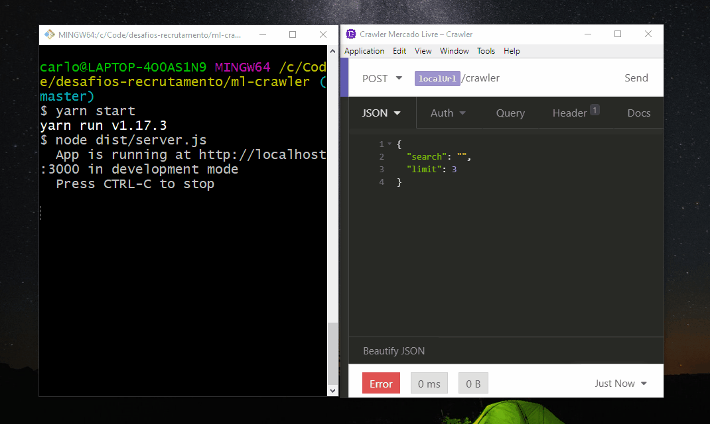

# Node Crawler 🕷️



## About ❔
Node.js Crawler for web scraping buying websites.
Currently fetching products data from "mercadolivre.com.br".

## Technologies ⌨️
Typescript, Node.js, Express, Axios and Cheerio

## How to test it out

1. Git clone
```
git clone https://github.com/carloseustaquio/node-crawler.git
cd node-crawler
```

2. Build and Run

Yarn:
```
yarn
yarn build
yarn start
```

NPM: 
```
npm install
npm run build
npm start
```

